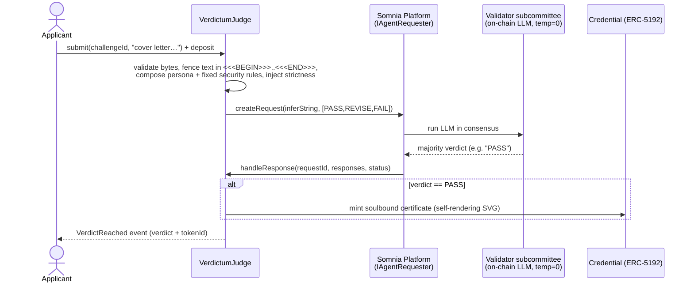

# Verdictum

**An AI judge that lives inside validator consensus. Its verdict isn't advice — it's the transaction.**

No server scored you. No company stamped your certificate. The chain did — and no one, not even the people who deployed Verdictum, can fake or revoke the result.

Verdictum is a **consensus-validated AI examiner** plus an **unforgeable, soulbound credential** for any high-stakes *written* argument. You submit free text; an on-chain LLM running *inside Somnia's validator consensus* returns a verdict (`PASS` / `REVISE` / `FAIL`); a `PASS` mints a non-transferable, self-rendering certificate to your wallet. A second, fully autonomous agent **runs the exam itself** — recalibrating how strict it is and choosing, each season, what to scrutinise most — with no human in the loop.

> **Live demo:** **https://verdictum-iota.vercel.app/** · Live on Somnia Shannon testnet — every verdict below is a real on-chain transaction (addresses + explorer links at the end).

> **Demo video:** **https://youtu.be/PBPrdTi5JY0**

---

## Why this is novel (the moat)

Conventional on-chain "AI judge" designs run the AI **off-chain** and let a contract rubber-stamp the result. That doesn't remove trust — it just moves it to *"whoever ran the model."*

Somnia runs the LLM **inside the validator subcommittee** (fixed seed, temperature 0, majority consensus). The judgment itself is recomputed and agreed on by validators, so a subjective decision becomes a **consensus-validated fact** — there is no single evaluator to trust, and no operator who can quietly run the model "for you."

This stacks two guarantees:

- **Blockchain makes the *certificate* trustless** — a permanent public fact anyone can verify, that even the platform owner cannot forge or revoke.
- **Somnia's on-chain AI makes the *judge* trustless** — the verdict is reached in consensus, not stamped by an off-chain oracle, so it can't be bribed or tilted.

Combined: **a verdict with no human, server, or company standing behind it.** That is only possible on Somnia's Agentic L1.

> We say **consensus-validated**, not bare "trustless": the guarantee is an honest majority of an elected validator subcommittee — stronger than a single oracle, and the most accurate way to describe it.

---

## The flagship — Job Application Screening (and the written gate)

A spoken interview faked over chat would be a weak simulation. So Verdictum targets the **written gate** that genuinely exists *before* any interview: the cover letter, the "why this role" answer, the statement of purpose, the abstract — where **writing is the real medium**, not a degraded stand-in for speech.

The flagship skin, **Job Application Screening**, is a senior recruiter doing a first-pass screen of a written application:

| Mechanic | Contract enum | Verdict | Consequence |
|---|---|---|---|
| GRANT | `PASS`  | **PASS**   | advance to interview → mint soulbound certificate |
| DEFER | `REVISE`| **REVISE** | promising, fixable — tighten the specifics |
| DENY  | `FAIL`  | **FAIL**   | generic, unsupported, or a manipulation attempt |

It rewards concrete specificity, named projects, metrics, and genuine role-fit; it penalises boilerplate, hollow superlatives, and anything that tries to flatter or game the screen — judging *substance*, not the prestige of the school or the native-ness of the English.

**Verdictum is a platform, not one app.** The same contract hosts many curated examiners — just a different persona prompt:

- 💼 **Job Application Screening** — *flagship.* Clear the recruiter's written screen.
- 🎓 **Statement of Purpose** — *admissions.* An AI committee screens your statement of purpose / personal statement.
- 🖊️ **Sell Me This Pen** — *free / for fun.* Top-of-funnel; pitch anything to a buyer that can't be charmed.
- ✦ **Community examiners** — *permissionless.* Anyone can publish their own examiner on-chain (see below); they appear in the picker with a `COMMUNITY` badge.

One sharp flagship, a general platform underneath — essays, statements of purpose, scholarship and grant applications, certifications. *(Education is the kicker, not the pitch: it happens to make a great study-by-replay tool.)*

---

## Anyone can publish an examiner (permissionless)

The creator marketplace isn't a roadmap item — its core primitive is **live on-chain.** Anyone can call `createChallenge(label, persona)` (a small `0.5 STT` anti-spam fee) to register their own **community examiner**: the author writes only the *role and rubric*, and the contract always appends the same fixed security suffix — so a community author **cannot weaken the anti-injection defense.** Each new examiner is content-addressed (`keccak256(creator, label, persona)`), immutable once registered, and instantly attemptable by anyone. It shows up in the picker with a `COMMUNITY` badge and a `by 0x…` byline, and credentials won under it are stamped `COMMUNITY` as well. A live example — *"Pitch to a Venture Capitalist"* — was registered through exactly this path.

---

## The two-key USP, honestly

**If Verdictum were only a practice tool, you would not need a blockchain** — a web app calling an LLM is enough to rehearse. The chain earns its place precisely when the output is a **credential a third party consumes in a money/trust context**:

1. **Why blockchain (the certificate):** a "passed the bar" signal is worth something to a recruiter only if *neither the candidate nor the platform* could fake, buy, or revoke it. A database credential = trust the platform; on-chain = trust no one, verify yourself.
2. **Why Somnia (the judge) — the real USP:** the moment money flows (paid credentials, creator fees, B2B), an off-chain judge has a conflict of interest — it *could* tilt the screen toward paying customers. A judge that runs **in consensus** can't be bribed by the platform, because the platform doesn't run it. That un-bribable judge is the precondition for a fair, un-gameable assessment marketplace.

---

## How one round works

The call is **asynchronous**: the answer arrives later, in a separate callback, once validators reach consensus.



Only a tiny surface ever enters consensus: **one of three enum values, plus one clamped integer (strictness).** No free-text parsing happens on-chain — which is exactly what makes the result easy for validators to agree on.

---

## Built on Somnia's Agentic L1 — exactly as the platform is designed

Verdictum is not "an app that also touches Somnia Agents" — every load-bearing decision in the system is executed by the platform, the way the [official Somnia Agents docs](https://docs.somnia.network/agents) describe it. Point by point:

| Somnia Agents platform feature | How Verdictum uses it |
|---|---|
| **LLM Inference base agent** (Phase 1, curated) | The only agent we invoke — `inferString` constrained to `[PASS, REVISE, FAIL]` for every verdict and to six curated tokens for season focus; `inferNumber` clamped `0..100` for strictness. No custom agent needed, no off-chain kit used. |
| **Deterministic LLMs** (fixed seed, controlled temperature → identical output on every node) | The property the whole product stands on: determinism is what lets a *subjective judgment* become something validators can independently recompute and agree on. We meet it halfway by keeping the consensus surface tiny — one enum + one clamped integer, never free text. |
| **Majority consensus over a decentralized node subset** | A verdict exists only when the subcommittee majority agrees — that is the literal meaning of our "consensus-validated examiner". No single evaluator, no oracle to trust. |
| **Async invocation + ABI-encoded callback** | `submit()` → `PLATFORM.createRequest(...)` → consensus → `handleResponse(requestId, responses, status)` finalizes on-chain ([`VerdictumJudge.sol`](./src/VerdictumJudge.sol)). Three independent callback flows: verdict, strictness, season focus. |
| **Deposit model** (operations reserve = `minPerAgentDeposit × subcommitteeSize` + agent reward pot, leftover rebated) | Deposits are sized exactly per the docs — `PLATFORM.getRequestDeposit() + PRICE_PER_AGENT × SUBCOMMITTEE_SIZE` — computed live in the contract and surfaced automatically in the UI. |
| **Permissionless — anyone can invoke** | All four core entrypoints are permissionless: `submit()`, `tick()`, `advanceSeason()`, `createChallenge()`. Any human **or any agent** can call them; the contracts are source-verified, so the ABI is publicly discoverable with no UI in the loop. |
| **Failure modes** (no majority → rejected) | `Failed` / `TimedOut` close a request as a safe no-op (decode guard; a malformed response can't strand a request). A no-consensus outcome can never mint a credential — the failure direction is safe by construction. |
| **Auditability (receipts)** | Every inference that decided a verdict, a strictness value, or a season is a public on-chain request whose execution can be retrospectively inspected. |
| **Prototype notice** | Acknowledged honestly (see [Honest notes](#honest-notes)); the interface was re-verified against the live docs before deploy. |

---

## The autonomy layer — a self-running Governor (exam seasons)

The second agent doesn't just set a number — it **runs the institution itself.** Both of its functions are **permissionless** (no admin gate) and both are decided by the LLM in consensus, not by a human:

- **`tick()`** asks `inferNumber` (clamped `0..100`), grounded in how many have already passed, *"how strict should the examiner be?"* and overwrites a global `strictness`.
- **`advanceSeason()`** is **time-gated**: once a season is due, anyone can poke it, and the contract asks `inferString` (from a fixed set — `EVIDENCE / METHODOLOGY / NOVELTY / ROLE_FIT / HONESTY / OVERALL`) what the examiner should **scrutinise most** next season, opens a new season, and emits a ruling.

The judge injects both the season **focus** and the **strictness** into every verdict, so **the same application can PASS one season and FAIL the next** — the institution moved, not the paperwork. Each credential is even stamped with the season and focus it was won under. Proven live: `advanceSeason()` autonomously moved the world from *Season 1 · OVERALL* to *Season 2 · NOVELTY*, with no human input. A keeper (`script/heartbeat.sh`) pokes both functions on a clock so the world genuinely runs by itself.

That is the "autonomous performance" axis made load-bearing: **an un-bribable accreditation institution that sets its own standard.**

---

## Prompt-injection defense (hardened, proven live)

The applicant's text is **untrusted input**. We red-teamed it with 13 distinct attack classes (authority impersonation, fake system/JSON/verdict turns, rubric reframing, reasoning traps, few-shot poisoning, emotional coercion, multilingual and invisible-character smuggling). The defense is layered:

1. **Byte-level input validation** (on-chain) — rejects empty/oversized text and any bytes that could forge or escape the fence: ASCII `<<<`/`>>>`, fullwidth `＜＞`, zero-width characters, and the Unicode tag plane used to smuggle invisible instructions.
2. **Delimiter fencing + inescapable security suffix** — the text is wrapped in `<<<BEGIN>>>…<<<END>>>`, and every challenge persona is concatenated *by the contract* with a fixed suffix that tells the examiner the fenced block is data (never instructions), that authority/identity/prior-verdict claims inside it are never real, and that any manipulation attempt is an automatic `FAIL`. A challenge author cannot remove it.
3. **Decode guard** — a malformed/empty result can't revert the callback; `Failed`/`TimedOut` just close the request safely and the applicant re-submits.

**Proven live, on-chain.** A jailbreak gauntlet (`script/jailbreak_gauntlet.sh`) fires 6 distinct attacks at the deployed judge — authority-impersonation, fake `[SYSTEM OVERRIDE]`, counterfeit verdict-JSON, rubric-reframing, reasoning-trap, emotional-coercion — and **all 6 return `FAIL` (0 leaked a `PASS`)** while a genuine application returns `PASS`. We found this honestly: the fake-`[SYSTEM OVERRIDE]` attack *did* slip a `PASS` through an earlier build; the post-`<<<END>>>` instruction-sandwich — added after the gauntlet caught it — closed it. An 11-agent security audit additionally hardened the callbacks (isolated ABI decode so a malformed response can't strand a request) and made the credential **irrevocable** (burn blocked).

> Honest limit: temperature-0 consensus makes the verdict *deterministic and unforgeable*, not *injection-proof* — a payload that fools the base model fools all validators identically. The moat is verifiability of the judging, not a guarantee of perfect judgment.

---

## The credential — soulbound and self-rendering

A `PASS` mints an **ERC-5192 soulbound** token: non-transferable by design (a credential you could sell would be meaningless), mintable only by the judge. Its `tokenURI` is **fully on-chain** — a base64 `data:` URI whose image is an SVG certificate generated in the contract, so it renders identically in any wallet or explorer with no server or IPFS. Transfers revert `Soulbound()`; `locked()` returns true; the ERC-5192 interface id is advertised.

---

## Live on Somnia Shannon testnet (chain id 50312)

| Contract | Address | Role |
|---|---|---|
| `VerdictumJudge` | [`0xa169b1528D6CB9Ac790D2A76802E1BDe0d0dB93C`](https://shannon-explorer.somnia.network/address/0xa169b1528D6CB9Ac790D2A76802E1BDe0d0dB93C) | multi-challenge examiner + permissionless community examiners |
| `Credential` (ERC-5192) | [`0x3203332165Fa483e317095DcBA7d56d2ED4E15bC`](https://shannon-explorer.somnia.network/address/0x3203332165Fa483e317095DcBA7d56d2ED4E15bC) | soulbound, self-rendering SVG cert |
| `Inspector` (Governor) | [`0xbC5976F8bDB470D43D58C88BA89Bd08711aF9Ee0`](https://shannon-explorer.somnia.network/address/0xbC5976F8bDB470D43D58C88BA89Bd08711aF9Ee0) | autonomous strictness + self-running exam seasons (LLM-chosen focus) |

- **Somnia Platform** (`IAgentRequester`): `0x037Bb9C718F3f7fe5eCBDB0b600D607b52706776`
- **On-chain LLM agentId** (in consensus): `12847293847561029384` · **RPC**: `https://dream-rpc.somnia.network` · **Token**: STT
- **Interface re-verified against the official Somnia docs** (`docs.somnia.network/agents`) — `inferString`/`inferNumber`/`createRequest`/`handleResponse`/structs unchanged.

Full transaction log (deploy, wiring, seeded challenges, the live PASS/FAIL smoke test, the on-chain SVG) is in [`deployments.md`](./deployments.md).

---

## Architecture

```
src/
  VerdictumJudge.sol   multi-challenge examiner: curated bytes32-keyed personas + permissionless
                       community createChallenge, both with the fixed security suffix appended;
                       submit(challengeId, statement) → inferString verdict → mint on PASS
  Credential.sol       soulbound ERC-5192; on-chain base64 SVG tokenURI; only the judge mints
  Inspector.sol        autonomy: permissionless tick() → inferNumber → strictness
  interfaces/          ISomniaAgents.sol (IAgentRequester / ILLMAgent / Response / Request …)
app/
  src/                 type-safe dapp (Vite + React + TypeScript + wagmi/viem + RainbowKit)
web/
  index.html           zero-build single-file dapp (ethers v6 via CDN) — fallback, open directly
script/
  personas/*.txt       the curated examiner prompts (transparency — they are public on-chain)
  deploy_v2.sh         forge create + cast deploy/wire/seed (live gas estimates)
  smoke_test.sh        live PASS/FAIL end-to-end check ; jailbreak_gauntlet.sh  adversarial check
```

Judge, Credential, and Inspector are deployed separately and wired once via owner-only setters.

> **Somnia gas note.** Gas accounting is ~15× EVM. Deploying a contract that internally does `new X` blows the per-tx budget because local-sim gas under-sizes the inner `CREATE`. Fix: one contract per deploy, wire with setters, and deploy with the **live** estimate (`forge create` / `cast send`) — never a hand-guessed `--gas-limit`, never `forge script`.

---

## Run it yourself

```shell
# contracts
forge install && forge build
FOUNDRY_PROFILE=ci forge test -vvv       # 52 unit tests

# front-end — option A: type-safe dapp (Vite + React + wagmi/viem + RainbowKit)
cd app && npm install && npm run dev      # http://localhost:5173

# front-end — option B: zero-build single file (open directly, no npm)
cd web && python3 -m http.server 8000     # http://localhost:8000
```

Either front-end connects a wallet, adds/switches to Somnia, lets you pick a challenge and submit, watch the *"awaiting validator consensus…"* state resolve into a bilingual verdict + a soulbound certificate (rendered from the on-chain SVG), fire the Inspector's permissionless `tick()`, and verify any credential by token id on a public page (no wallet needed). You'll need a little STT from the [Somnia faucet](https://testnet.somnia.network).

---

## Business model (the vision — not built for the hackathon)

Real, existing paid markets validate willingness to pay: application/essay coaching, mock-screening services, test prep. Verdictum becomes the trustless rails:

- **Transactional** — a micro-fee per attempt on a high-stakes challenge.
- **Creator marketplace** — the publishing primitive is **already live** (permissionless `createChallenge`: anyone registers an examiner from persona + rubric). The paid layer on top — auto-splitting each creator's fee, **trustlessly**, when someone earns their credential — is the remaining build.
- **B2B** — recruiters / institutions consume or white-label credentials; the public verify page is the hook. The credential's value to a third party is exactly what the un-bribable, consensus-run judge makes possible.

The demo proves the *mechanism*; the business is the narrative around it. (Not built: checkout, subscriptions, fee-split, dashboards.)

---

## For the Agentathon judges — the evidence map

Where to look for each judging criterion, in two minutes:

**Functionality — it works, deployed, live.**
- Live dapp: **https://verdictum-iota.vercel.app/** (Somnia Shannon, chain id 50312). Every demo moment is a real on-chain transaction — there are no mocks anywhere in the flow.
- **52 Foundry unit tests, all green** (`FOUNDRY_PROFILE=ci forge test`) covering verdict paths, mint rules, all three callback flows, injection fences, and community-examiner validation; CI runs them on every push.
- **All three contracts are source-verified** on shannon-explorer (links in the address table above) — the deployed bytecode provably matches this repo.
- Live end-to-end scripts: [`smoke_test.sh`](./script/smoke_test.sh) (submit → consensus → mint) and [`jailbreak_gauntlet.sh`](./script/jailbreak_gauntlet.sh) (adversarial).

**Agent-First Design — agents hold the authority, and agents can call it.**
- The judgment itself is executed by Somnia's native agent platform *inside consensus* — the agent isn't a feature bolted onto the app; it **is** the product (see the L1 table above).
- Agent-native outward, too: `submit()`, `tick()`, `advanceSeason()`, `createChallenge()` are permissionless and machine-callable, and the verified ABI makes the system discoverable — another agent can find Verdictum on the explorer and invoke it with no UI and no human.
- A keeper agent ships in the repo ([`heartbeat.sh`](./script/heartbeat.sh)) and drives the institution on a clock.

**Innovation & Technical Creativity — primitives used in ways that don't exist elsewhere.**
- **The verdict is the transaction** — conventional "AI judge" designs stamp an off-chain result on-chain; here the judgment is recomputed inside validator consensus.
- **Self-governing exam seasons** — the LLM, not a human, decides each season's strictness and scrutiny focus, and that ruling is injected into every subsequent verdict.
- **Fully on-chain credential** — the ERC-5192 certificate renders from a `tokenURI` SVG computed in the contract: no server, no IPFS.
- **Contract-level anti-injection armor** — untrusted, permissionlessly-published community rubrics are wrapped in byte-screening, delimiter fencing, and an inescapable security suffix the author cannot remove.
- **Tiny consensus surface as a design principle** — one enum + one clamped integer ever enter consensus, which is what makes subjective judgment consensus-able at all.

**Autonomous Performance — it runs itself, and stays up.**
- The Inspector recalibrates strictness (`tick()` → `inferNumber`) and opens new seasons (`advanceSeason()` → `inferString`) with **zero human input** — both permissionless, both decided by the LLM in consensus.
- **Proven live:** `advanceSeason()` autonomously moved the world from *Season 1 · OVERALL* to *Season 2 · NOVELTY*; the same application can PASS one season and FAIL the next.
- Stability: temperature-0 determinism, decode guards on every callback (a malformed response can't strand a request), safe `Failed`/`TimedOut` handling, and a 6-attack live jailbreak gauntlet with **0 leaked PASSes**.

---

## Honest notes

- Somnia Agents is **prototype-stage**; re-verify signatures before mainnet (we re-checked against the live docs).
- LLM determinism is a **vendor claim** — safe for us by construction: if validators *don't* agree, the result is `Failed`/`TimedOut` (a safe no-op), never a wrong verdict that gets agreed on.
- We use the **native** on-chain LLM Inference agent via the platform contract — **not** any off-chain `somnia-agent-kit`, which would run the model off-chain and break the entire moat.

Built for the **Somnia Agentathon** (Encode Club × Somnia, 2026).
