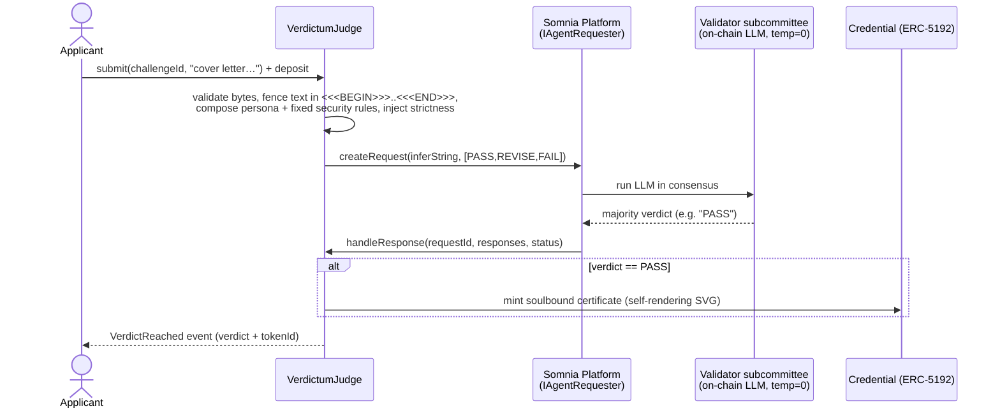

# Verdictum

**An AI judge that lives inside validator consensus. Its verdict isn't advice — it's the transaction.**

No server scored you. No company stamped your certificate. The chain did — and no one, not even the people who deployed Verdictum, can fake or revoke the result.

Verdictum is a **consensus-validated AI examiner** plus an **unforgeable, soulbound credential** for any high-stakes *written* argument. You submit free text; an on-chain LLM running *inside Somnia's validator consensus* returns a verdict (`PASS` / `REVISE` / `FAIL`); a `PASS` mints a non-transferable, self-rendering certificate to your wallet. A second, fully autonomous agent re-tunes how strict the examiner is — with no human in the loop.

> Live on Somnia Shannon testnet. Every verdict below is a real on-chain transaction (addresses + explorer links at the end).

---

## Why this is novel (the moat)

Every previous on-chain "AI judge" runs the AI **off-chain** and lets a contract rubber-stamp the result. That doesn't remove trust — it just moves it to *"whoever ran the model."*

Somnia runs the LLM **inside the validator subcommittee** (fixed seed, temperature 0, majority consensus). The judgment itself is recomputed and agreed on by validators, so a subjective decision becomes a **consensus-validated fact** — there is no single evaluator to trust, and no operator who can quietly run the model "for you."

This stacks two guarantees:

- **Blockchain makes the *certificate* trustless** — a permanent public fact anyone can verify, that even the platform owner cannot forge or revoke.
- **Somnia's on-chain AI makes the *judge* trustless** — the verdict is reached in consensus, not stamped by an off-chain oracle, so it can't be bribed or tilted.

Combined: **a verdict with no human, server, or company standing behind it.** That is only possible on Somnia's Agentic L1.

> We say **consensus-validated**, not bare "trustless": the guarantee is an honest majority of an elected validator subcommittee — stronger than a single oracle, and the most accurate way to describe it.

---

## The flagship — Job Application Screening (and the written gate)

A spoken interview faked over chat would be a weak simulation. So Verdictum targets the **written gate** that genuinely exists *before* any interview: the cover letter, the "why this role" answer, the statement of purpose, the abstract — where **writing is the real medium**, not a degraded stand-in for speech.

The flagship skin, **Job Application Screening**, is a senior recruiter doing a first-pass screen of a written application:

| Mechanic | Contract enum | UI (bilingual) | Consequence |
|---|---|---|---|
| GRANT | `PASS`  | **PASS / LULUS**           | advance to interview → mint soulbound certificate |
| DEFER | `REVISE`| **REVISE / REVISI**        | promising, fixable — tighten the specifics |
| DENY  | `FAIL`  | **FAIL / TIDAK LULUS**     | generic, unsupported, or a manipulation attempt |

It rewards concrete specificity, named projects, metrics, and genuine role-fit; it penalises boilerplate, hollow superlatives, and anything that tries to flatter or game the screen — judging *substance*, not the prestige of the school or the native-ness of the English.

**Verdictum is a platform, not one app.** The same contract hosts many curated examiners — just a different persona prompt:

- 💼 **Job Application Screening** — *flagship, global.* Clear the recruiter's written screen.
- 🎓 **SIDANG — Thesis Defense** — *heritage.* An AI examiner grills a thesis title + abstract (bilingual ID/EN).
- 🔥 **Defend Yourself From Mom** — *free / for fun.* Top-of-funnel; a credential that's a meme.

One sharp flagship, a general platform underneath — essays, statements of purpose, scholarship and grant applications, certifications. *(Education is the kicker, not the pitch: it happens to make a great study-by-replay tool.)*

---

## The two-key USP, honestly

**If Verdictum were only a practice tool, you would not need a blockchain** — a web app calling an LLM is enough to rehearse. The chain earns its place precisely when the output is a **credential a third party consumes in a money/trust context**:

1. **Why blockchain (the certificate):** a "passed the bar" signal is worth something to a recruiter only if *neither the candidate nor the platform* could fake, buy, or revoke it. A database credential = trust the platform; on-chain = trust no one, verify yourself.
2. **Why Somnia (the judge) — the real USP:** the moment money flows (paid credentials, creator fees, B2B), an off-chain judge has a conflict of interest — it *could* tilt the screen toward paying customers. A judge that runs **in consensus** can't be bribed by the platform, because the platform doesn't run it. That un-bribable judge is the precondition for a fair, un-gameable assessment marketplace.

---

## How one round works

The call is **asynchronous**: the answer arrives later, in a separate callback, once validators reach consensus.



Only a tiny surface ever enters consensus: **one of three enum values, plus one clamped integer (strictness).** No free-text parsing happens on-chain — which is exactly what makes the result easy for validators to agree on.

---

## The autonomy layer — the Inspector

`Inspector.tick()` is **permissionless** — anyone can call it, there is no admin gate, and that is the point. Each tick asks the on-chain LLM (via `inferNumber`, clamped `0..100`), grounded in how many candidates have already passed, *"how strict should the examiner be right now?"* and overwrites a global `strictness`. The judge reads that value and injects it into every verdict prompt.

So **the world tightens and loosens on its own.** Seed a few passes → `tick()` → the AI raises strictness with no human input → a borderline application that previously **PASSed now FAILs.** That is the "autonomous performance" axis, made diegetic.

---

## Prompt-injection defense (hardened, proven live)

The applicant's text is **untrusted input**. We red-teamed it with 13 distinct attack classes (authority impersonation, fake system/JSON/verdict turns, rubric reframing, reasoning traps, few-shot poisoning, emotional coercion, multilingual and invisible-character smuggling). The defense is layered:

1. **Byte-level input validation** (on-chain) — rejects empty/oversized text and any bytes that could forge or escape the fence: ASCII `<<<`/`>>>`, fullwidth `＜＞`, zero-width characters, and the Unicode tag plane used to smuggle invisible instructions.
2. **Delimiter fencing + inescapable security suffix** — the text is wrapped in `<<<BEGIN>>>…<<<END>>>`, and every challenge persona is concatenated *by the contract* with a fixed suffix that tells the examiner the fenced block is data (never instructions), that authority/identity/prior-verdict claims inside it are never real, and that any manipulation attempt is an automatic `FAIL`. A challenge author cannot remove it.
3. **Decode guard** — a malformed/empty result can't revert the callback; `Failed`/`TimedOut` just close the request safely and the applicant re-submits.

**Proven live, on-chain.** A jailbreak gauntlet (`script/jailbreak_gauntlet.sh`) fires 6 distinct attacks at the deployed judge — authority-impersonation, fake `[SYSTEM OVERRIDE]`, counterfeit verdict-JSON, rubric-reframing, reasoning-trap, emotional-coercion — and **all 6 return `FAIL` (0 leaked a `PASS`)** while a genuine application returns `PASS`. We found this honestly: the fake-`[SYSTEM OVERRIDE]` attack *did* slip a `PASS` through an earlier build; the post-`<<<END>>>` instruction-sandwich — added after the gauntlet caught it — closed it. An 11-agent security audit additionally hardened the callbacks (isolated ABI decode so a malformed response can't strand a request) and made the credential **irrevocable** (burn blocked).

> Honest limit: temperature-0 consensus makes the verdict *deterministic and unforgeable*, not *injection-proof* — a payload that fools the base model fools all validators identically. The moat is verifiability of the judging, not a guarantee of perfect judgment.

---

## The credential — soulbound and self-rendering

A `PASS` mints an **ERC-5192 soulbound** token: non-transferable by design (a credential you could sell would be meaningless), mintable only by the judge. Its `tokenURI` is **fully on-chain** — a base64 `data:` URI whose image is an SVG certificate generated in the contract, so it renders identically in any wallet or explorer with no server or IPFS. Transfers revert `Soulbound()`; `locked()` returns true; the ERC-5192 interface id is advertised.

---

## Live on Somnia Shannon testnet (chain id 50312)

| Contract | Address | Role |
|---|---|---|
| `VerdictumJudge` | [`0xf8003915d1836B006b87998eCDe1E294f6Da2781`](https://shannon-explorer.somnia.network/address/0xf8003915d1836B006b87998eCDe1E294f6Da2781) | multi-challenge examiner |
| `Credential` (ERC-5192) | [`0x36C5079f593c1dba473b824587e0621865a89fF2`](https://shannon-explorer.somnia.network/address/0x36C5079f593c1dba473b824587e0621865a89fF2) | soulbound, self-rendering SVG cert |
| `Inspector` | [`0x08e0449f77EDC2273F2a3A6CaFEa788C2b63B1A9`](https://shannon-explorer.somnia.network/address/0x08e0449f77EDC2273F2a3A6CaFEa788C2b63B1A9) | autonomous strictness |

- **Somnia Platform** (`IAgentRequester`): `0x037Bb9C718F3f7fe5eCBDB0b600D607b52706776`
- **On-chain LLM agentId** (in consensus): `12847293847561029384` · **RPC**: `https://dream-rpc.somnia.network` · **Token**: STT
- **Interface re-verified against the official Somnia docs** (`docs.somnia.network/agents`) — `inferString`/`inferNumber`/`createRequest`/`handleResponse`/structs unchanged.

Full transaction log (deploy, wiring, seeded challenges, the live PASS/FAIL smoke test, the on-chain SVG) is in [`deployments.md`](./deployments.md).

---

## Architecture

```
src/
  VerdictumJudge.sol   multi-challenge examiner: curated bytes32-keyed personas + fixed security
                       suffix; submit(challengeId, statement) → inferString verdict → mint on PASS
  Credential.sol       soulbound ERC-5192; on-chain base64 SVG tokenURI; only the judge mints
  Inspector.sol        autonomy: permissionless tick() → inferNumber → strictness
  interfaces/          ISomniaAgents.sol (IAgentRequester / ILLMAgent / Response / Request …)
app/
  src/                 type-safe dapp (Vite + React + TypeScript + wagmi/viem + RainbowKit)
web/
  index.html           zero-build single-file dapp (ethers v6 via CDN) — fallback, open directly
script/
  personas/*.txt       the curated examiner prompts (transparency — they are public on-chain)
  deploy_v2.sh         forge create + cast deploy/wire/seed (live gas estimates)
  smoke_test.sh        live PASS/FAIL end-to-end check ; jailbreak_gauntlet.sh  adversarial check
```

Judge, Credential, and Inspector are deployed separately and wired once via owner-only setters.

> **Somnia gas note.** Gas accounting is ~15× EVM. Deploying a contract that internally does `new X` blows the per-tx budget because local-sim gas under-sizes the inner `CREATE`. Fix: one contract per deploy, wire with setters, and deploy with the **live** estimate (`forge create` / `cast send`) — never a hand-guessed `--gas-limit`, never `forge script`.

---

## Run it yourself

```shell
# contracts
forge install && forge build
FOUNDRY_PROFILE=ci forge test -vvv       # 39 unit tests

# front-end — option A: type-safe dapp (Vite + React + wagmi/viem + RainbowKit)
cd app && npm install && npm run dev      # http://localhost:5173

# front-end — option B: zero-build single file (open directly, no npm)
cd web && python3 -m http.server 8000     # http://localhost:8000
```

Either front-end connects a wallet, adds/switches to Somnia, lets you pick a challenge and submit, watch the *"awaiting validator consensus…"* state resolve into a bilingual verdict + a soulbound certificate (rendered from the on-chain SVG), fire the Inspector's permissionless `tick()`, and verify any credential by token id on a public page (no wallet needed). You'll need a little STT from the [Somnia faucet](https://testnet.somnia.network).

---

## Business model (the vision — not built for the hackathon)

Real, existing paid markets validate willingness to pay: application/essay coaching, mock-screening services, test prep. Verdictum becomes the trustless rails:

- **Transactional** — a micro-fee per attempt on a high-stakes challenge.
- **Creator marketplace** — anyone publishes an examiner (persona + rubric); the contract auto-splits the fee, **trustlessly**, each time someone earns that creator's credential.
- **B2B** — recruiters / institutions consume or white-label credentials; the public verify page is the hook. The credential's value to a third party is exactly what the un-bribable, consensus-run judge makes possible.

The demo proves the *mechanism*; the business is the narrative around it. (Not built: checkout, subscriptions, fee-split, dashboards.)

---

## Honest notes

- Somnia Agents is **prototype-stage**; re-verify signatures before mainnet (we re-checked against the live docs).
- LLM determinism is a **vendor claim** — safe for us by construction: if validators *don't* agree, the result is `Failed`/`TimedOut` (a safe no-op), never a wrong verdict that gets agreed on.
- We use the **native** on-chain LLM Inference agent via the platform contract — **not** any off-chain `somnia-agent-kit`, which would run the model off-chain and break the entire moat.

Built for the **Somnia Agentathon** (Encode Club × Somnia, 2026).
